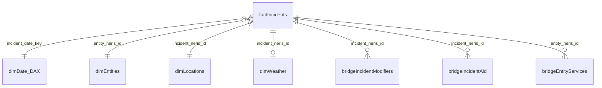
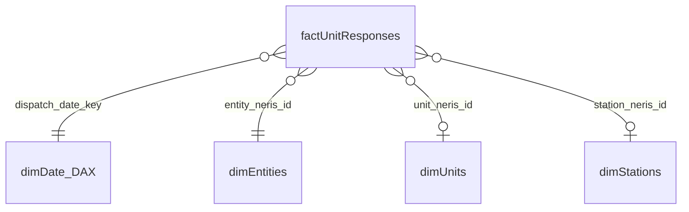
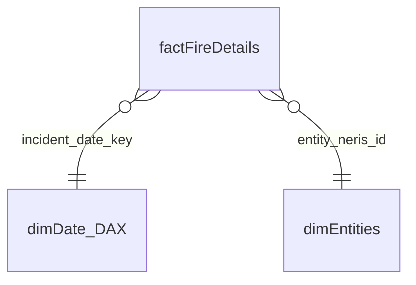

# NERIS Gold Schema (`neris`)

Reference for the Gold **Materialized Lake Views (MLVs)** created by **`NB_DIF_GOLD_NERIS_MLV`**, which reads NERIS Silver Delta tables from `LH_SILVER_LAYER.neris` and presents them as a star-schema dimensional model in `LH_GOLD_LAYER.neris`.

This document maps every Gold **table**, its **type** (dimension/fact/bridge), **source Silver table(s)**, and **columns** included. The Gold layer is optimized for Power BI semantic modeling.

> **Schema location:** `LH_GOLD_LAYER` → schema `neris` → `neris.<table>`.

---

## Conventions

- **Strict star schema** — no snowflaking, no fact-to-fact joins, no dimension-to-dimension FKs. Each fact connects directly and independently to its own set of dimensions. Bridge tables handle many-to-many relationships.
- **4 independent stars** — each fact table (`factIncidents`, `factUnitResponses`, `factCasualties`, `factFireDetails`) is the center of its own star schema with its own set of directly-connected dimensions.
- **All Gold objects are Materialized Lake Views (MLVs).** Fabric auto-refreshes them from the underlying Silver Delta tables. No manual ETL or scheduling is needed.
- **`CREATE OR REPLACE`** — the notebook is idempotent and safe to re-run.
- **Power BI naming** — PascalCase with prefixes: `dimXxx` (dimensions), `factXxx` (facts), `bridgeXxx` (bridge/many-to-many tables).
- **`date_key` columns** — Integer in `YYYYMMDD` format (e.g., `20260615`). Present on **every** fact table for direct relationship to a DAX-generated `dimDate` in Power BI. No fact-to-fact date resolution.
- **SCD2 filtering** — `factIncidents` and `dimEntities` filter to `IsCurrent = true` from the Silver SCD2 tables, so Gold always shows the current version of each record.
- **Silver lineage columns** (`_silver_run_id`, `_silver_timestamp`, `HashedNonKeyColumns`) are **not** carried to Gold — they are internal to Silver.
- **Degenerate dimensions** — `incident_neris_id` appears on Stars 2/3/4 as a degenerate dimension key (for drill-through/filtering) but does NOT create a relationship to `factIncidents`.

---

## Dimensional Model Overview

This Gold layer uses **strict star schema** — no snowflaking, no fact-to-fact joins. Each fact table is the center of its own independent star. Dimensions connect directly to facts only. Bridge tables handle many-to-many relationships.

### Star 1: factIncidents



> `dimIncidentTypes` is a role-playing/reference dimension — the type hierarchy (`type_level1_type`, `type_level2_description`, `type_level3_detail`) is denormalized directly onto `factIncidents`. The standalone `dimIncidentTypes` table serves as a slicer/filter lookup.

### Star 2: factUnitResponses



### Star 3: factCasualties


### Star 4: factFireDetails



> **dimDate (DAX)** is generated in the Power BI semantic model — not stored in the Gold lakehouse. All four stars connect to it via their respective `*_date_key` columns (YYYYMMDD integer).

---

## Object Inventory (13 Gold MLVs)

| Category | Gold Table | Source Silver Table(s) | Grain | Star(s) |
|---|---|---|---|---|
| **Dimension** | `dimEntities` | `entity_core` (IsCurrent) | 1 row per entity | All 4 stars |
| **Dimension** | `dimStations` | `entity_station` | 1 row per station | Star 2 |
| **Dimension** | `dimUnits` | `entity_station_unit` | 1 row per unit | Star 2 |
| **Dimension** | `dimLocations` | `incident_location` LEFT JOIN `incident_census_tract` | 1 row per incident location | Star 1 |
| **Dimension** | `dimIncidentTypes` | `incident_type` (DISTINCT) | 1 row per type hierarchy | Star 1 (reference/slicer) |
| **Dimension** | `dimWeather` | `incident_weather` | 1 row per incident weather obs | Star 1 |
| **Fact** | `factIncidents` | `incident_core` + `incident_dispatch` + `incident_type` (primary) | 1 row per incident | Star 1 |
| **Fact** | `factUnitResponses` | `incident_dispatch_unit_response` UNION `incident_unit_response` | 1 row per unit per incident | Star 2 |
| **Fact** | `factCasualties` | `incident_casualty_rescue` + `incident_dispatch` | 1 row per casualty/rescue | Star 3 |
| **Fact** | `factFireDetails` | `incident_fire_detail` + `incident_dispatch` | 1 row per fire incident | Star 4 |
| **Bridge** | `bridgeIncidentModifiers` | `incident_special_modifier` | 1 row per modifier per incident | Star 1 |
| **Bridge** | `bridgeIncidentAid` | `incident_aid` UNION `incident_nonfd_aid` | 1 row per aid record | Star 1 |
| **Bridge** | `bridgeEntityServices` | `entity_service` | 1 row per service per entity | Star 1 (via entity) |

### Silver tables NOT included in Gold

| Silver Table | Reason |
|---|---|
| `incident_exposure` | Low-value JSON blob only; no analytic columns |
| `incident_hazsit_detail`, `incident_hazsit_chemical`, `incident_hazsit_medical_detail` | Low volume, niche; can be added later |
| `incident_fire_detail_electric_hazard` | Sparse sub-detail of fire; can be added later |
| `incident_history_event` | Audit/workflow trail — not analytic |
| `accountenrollment_core` | Dormant/config table |
| `entity_region_set`, `entity_region`, `entity_aid_agreement` | Administrative/geo boundaries; can be added later |
| `incident_medical_detail` | Can be added as a future Gold fact if needed |

---

# Dimensions

## `neris.dimEntities`

**Source:** `LH_SILVER_LAYER.neris.entity_core` (WHERE `IsCurrent = true`) · **Grain:** 1 row per fire department/entity

| Gold Column | Data Type | Source Column | Notes |
|---|---|---|---|
| `entity_neris_id` | string | `entity_neris_id` | Primary key |
| `name` | string | `name` | Department name |
| `version` | string | `version` | |
| `last_modified` | timestamp | `last_modified` | |
| `onboarding_status` | string | `onboarding_status` | |
| `department_type` | string | `department_type` | |
| `entity_type` | string | `entity_type` | |
| `address_line_1` | string | `address_line_1` | Physical address |
| `address_line_2` | string | `address_line_2` | |
| `city` | string | `city` | |
| `state` | string | `state` | |
| `zip_code` | string | `zip_code` | |
| `mail_address_line_1` | string | `mail_address_line_1` | Mailing address |
| `mail_address_line_2` | string | `mail_address_line_2` | |
| `mail_city` | string | `mail_city` | |
| `mail_state` | string | `mail_state` | |
| `mail_zip_code` | string | `mail_zip_code` | |
| `email` | string | `email` | |
| `website` | string | `website` | |
| `time_zone` | string | `time_zone` | |
| `internal_id` | string | `internal_id` | |
| `rms_software` | string | `rms_software` | |
| `continue_edu` | string | `continue_edu` | |
| `population_protected` | integer | `population_protected` | |
| `population_source` | string | `population_source` | |
| `dispatch_avl_usage` | string | `dispatch_avl_usage` | |
| `dispatch_center_id` | string | `dispatch_center_id` | |
| `dispatch_cad_software` | string | `dispatch_cad_software` | |
| `dispatch_psap_type` | string | `dispatch_psap_type` | |
| `dispatch_protocol_fire` | string | `dispatch_protocol_fire` | |
| `dispatch_protocol_med` | string | `dispatch_protocol_med` | |
| `staffing_ff_career_ft` | integer | `staffing_ff_career_ft` | Firefighter — career full-time |
| `staffing_ff_career_pt` | integer | `staffing_ff_career_pt` | Firefighter — career part-time |
| `staffing_ff_volunteer` | integer | `staffing_ff_volunteer` | Firefighter — volunteer |
| `staffing_ems_career_ft` | integer | `staffing_ems_career_ft` | EMS — career full-time |
| `staffing_ems_career_pt` | integer | `staffing_ems_career_pt` | EMS — career part-time |
| `staffing_ems_volunteer` | integer | `staffing_ems_volunteer` | EMS — volunteer |
| `staffing_civ_career_ft` | integer | `staffing_civ_career_ft` | Civilian — career full-time |
| `staffing_civ_career_pt` | integer | `staffing_civ_career_pt` | Civilian — career part-time |
| `staffing_civ_volunteer` | integer | `staffing_civ_volunteer` | Civilian — volunteer |
| `assessment_iso_rating` | string | `assessment_iso_rating` | |
| `assessment_cpse_accredited` | boolean | `assessment_cpse_accredited` | |
| `assessment_caas_accredited` | boolean | `assessment_caas_accredited` | |
| `shift_count` | integer | `shift_count` | |
| `shift_duration` | float | `shift_duration` | Hours |
| `shift_signup` | string | `shift_signup` | |
| `feature_flags_json` | string | `feature_flags_json` | JSON blob |
| `location_json` | string | `location_json` | JSON blob |

---

## `neris.dimStations`

**Source:** `LH_SILVER_LAYER.neris.entity_station` · **Grain:** 1 row per station

| Gold Column | Data Type | Source Column | Notes |
|---|---|---|---|
| `entity_neris_id` | string | `entity_neris_id` | FK → `dimEntities` |
| `station_neris_id` | string | `station_neris_id` | Primary key |
| `station_id` | string | `station_id` | |
| `internal_id` | string | `internal_id` | |
| `version` | string | `version` | |
| `address_line_1` | string | `address_line_1` | |
| `address_line_2` | string | `address_line_2` | |
| `city` | string | `city` | |
| `state` | string | `state` | |
| `zip_code` | string | `zip_code` | |
| `staffing` | integer | `staffing` | |
| `location_url` | string | `location_url` | |

---

## `neris.dimUnits`

**Source:** `LH_SILVER_LAYER.neris.entity_station_unit` · **Grain:** 1 row per unit per station

| Gold Column | Data Type | Source Column | Notes |
|---|---|---|---|
| `entity_neris_id` | string | `entity_neris_id` | FK → `dimEntities` |
| `station_neris_id` | string | `station_neris_id` | FK → `dimStations` |
| `unit_neris_id` | string | `unit_neris_id` | Primary key |
| `version` | string | `version` | |
| `type` | string | `type` | Unit/apparatus type |
| `staffing` | integer | `staffing` | |
| `dedicated_staffing` | integer | `dedicated_staffing` | |
| `cad_designation_1` | string | `cad_designation_1` | |
| `cad_designation_2` | string | `cad_designation_2` | |

---

## `neris.dimLocations`

**Source:** `LH_SILVER_LAYER.neris.incident_location` LEFT JOIN `incident_census_tract` · **Grain:** 1 row per incident location

| Gold Column | Data Type | Source Column | Notes |
|---|---|---|---|
| `incident_neris_id` | string | `loc.incident_neris_id` | FK → `factIncidents` |
| `entity_neris_id` | string | `loc.entity_neris_id` | FK → `dimEntities` |
| `location_neris_uid` | string | `loc.location_neris_uid` | |
| `neighborhood_community` | string | `loc.neighborhood_community` | |
| `incorporated_municipality` | string | `loc.incorporated_municipality` | |
| `county` | string | `loc.county` | |
| `state` | string | `loc.state` | |
| `postal_code` | string | `loc.postal_code` | |
| `postal_code_extension` | string | `loc.postal_code_extension` | |
| `street_prefix_direction` | string | `loc.street_prefix_direction` | |
| `street` | string | `loc.street` | |
| `street_postfix` | string | `loc.street_postfix` | |
| `complete_number` | string | `loc.complete_number` | |
| `room` | string | `loc.room` | |
| `floor` | string | `loc.floor` | |
| `unit_value` | string | `loc.unit_value` | |
| `structure` | string | `loc.structure` | |
| `additional_info` | string | `loc.additional_info` | |
| `fips_code` | string | `ct.fips_code` | From census tract |
| `census_area` | float | `ct.area` | Aliased from `area` |
| `census_population_density` | float | `ct.population_density` | Aliased from `population_density` |

---

## `neris.dimIncidentTypes`

**Source:** `LH_SILVER_LAYER.neris.incident_type` (SELECT DISTINCT) · **Grain:** 1 row per unique type hierarchy

| Gold Column | Data Type | Source Column | Notes |
|---|---|---|---|
| `type_level1_type` | string | `type_level1_type` | Top-level category (e.g., `FIRE`, `EMS`) |
| `type_level2_description` | string | `type_level2_description` | Mid-level (e.g., `STRUCTURE_FIRE`) |
| `type_level3_detail` | string | `type_level3_detail` | Detail level |

> **Note:** This is a _role-playing dimension_ — `factIncidents` carries the type hierarchy directly (denormalized from the primary incident type). This standalone dimension provides a complete type lookup for slicers and filters.

---

## `neris.dimWeather`

**Source:** `LH_SILVER_LAYER.neris.incident_weather` · **Grain:** 1 row per incident weather observation

| Gold Column | Data Type | Source Column | Notes |
|---|---|---|---|
| `incident_neris_id` | string | `incident_neris_id` | FK → `factIncidents` |
| `entity_neris_id` | string | `entity_neris_id` | FK → `dimEntities` |
| `timestamp` | timestamp | `timestamp` | Observation time |
| `main` | string | `main` | Weather main (e.g., `Clear`) |
| `description` | string | `description` | Detail description |
| `temp` | float | `temp` | °F |
| `dew_point` | float | `dew_point` | °F |
| `feels_like` | float | `feels_like` | °F |
| `pressure` | float | `pressure` | hPa |
| `humidity` | integer | `humidity` | % |
| `temp_min` | float | `temp_min` | °F |
| `temp_max` | float | `temp_max` | °F |
| `heat_index` | float | `heat_index` | |
| `windchill` | float | `windchill` | |
| `visibility` | float | `visibility` | meters |
| `wind_speed` | float | `wind_speed` | |
| `wind_deg` | integer | `wind_deg` | degrees |
| `cloud_percent` | integer | `cloud_percent` | % |
| `rain_accum_1h` | float | `rain_accum_1h` | |
| `snow_vol_1h` | float | `snow_vol_1h` | |
| `day_part` | string | `day_part` | |
| `air_quality_co` | float | `air_quality_co` | |
| `air_quality_o3` | float | `air_quality_o3` | |
| `air_quality_no2` | float | `air_quality_no2` | |
| `air_quality_so2` | float | `air_quality_so2` | |
| `air_quality_pm2_5` | float | `air_quality_pm2_5` | |
| `air_quality_pm10` | float | `air_quality_pm10` | |
| `air_quality_us_epa_index` | float | `air_quality_us_epa_index` | |
| `air_quality_gb_defra_index` | float | `air_quality_gb_defra_index` | |
| `pollen_hazel` | integer | `pollen_hazel` | |
| `pollen_alder` | integer | `pollen_alder` | |
| `pollen_birch` | integer | `pollen_birch` | |
| `pollen_oak` | integer | `pollen_oak` | |
| `pollen_grass` | integer | `pollen_grass` | |
| `pollen_mugwort` | integer | `pollen_mugwort` | |
| `pollen_ragweed` | integer | `pollen_ragweed` | |

---

# Facts

## `neris.factIncidents`

**Source:** `incident_core` (IsCurrent) LEFT JOIN `incident_dispatch` LEFT JOIN `incident_type` (primary) · **Grain:** 1 row per incident

| Gold Column | Data Type | Source | Notes |
|---|---|---|---|
| `incident_neris_id` | string | `ic.incident_neris_id` | Primary key |
| `entity_neris_id` | string | `ic.entity_neris_id` | FK → `dimEntities` |
| `last_modified` | timestamp | `ic.last_modified` | |
| `submitter_account_type` | string | `ic.submitter_account_type` | |
| `department_time_zone` | string | `ic.department_time_zone` | |
| `base_neris_uid` | string | `ic.base_neris_uid` | |
| `base_incident_number` | string | `ic.base_incident_number` | |
| `people_present` | integer | `ic.people_present` | Measure |
| `animals_rescued` | integer | `ic.animals_rescued` | Measure |
| `displacement_count` | integer | `ic.displacement_count` | Measure |
| `displacement_causes` | string | `ic.displacement_causes` | Pipe-separated |
| `actions` | string | `ic.actions` | Pipe-separated |
| `impediment_narrative` | string | `ic.impediment_narrative` | |
| `outcome_narrative` | string | `ic.outcome_narrative` | |
| `location_use_type` | string | `ic.location_use_type` | |
| `location_use_in_use` | string | `ic.location_use_in_use` | |
| `location_use_vacancy_cause` | string | `ic.location_use_vacancy_cause` | |
| `incident_status` | string | `ic.incident_status` | |
| `incident_status_created_by` | string | `ic.incident_status_created_by` | |
| `incident_status_last_modified` | timestamp | `ic.incident_status_last_modified` | |
| `tactic_command_established` | timestamp | `ic.tactic_command_established` | |
| `tactic_completed_sizeup` | timestamp | `ic.tactic_completed_sizeup` | |
| `tactic_suppression_complete` | timestamp | `ic.tactic_suppression_complete` | |
| `tactic_primary_search_begin` | timestamp | `ic.tactic_primary_search_begin` | |
| `tactic_primary_search_complete` | timestamp | `ic.tactic_primary_search_complete` | |
| `tactic_water_on_fire` | timestamp | `ic.tactic_water_on_fire` | |
| `tactic_fire_under_control` | timestamp | `ic.tactic_fire_under_control` | |
| `tactic_fire_knocked_down` | timestamp | `ic.tactic_fire_knocked_down` | |
| `tactic_extrication_complete` | timestamp | `ic.tactic_extrication_complete` | |
| `smoke_alarm_presence` | string | `ic.smoke_alarm_presence` | |
| `fire_alarm_presence` | string | `ic.fire_alarm_presence` | |
| `other_alarm_presence` | string | `ic.other_alarm_presence` | |
| `fire_suppression_presence` | string | `ic.fire_suppression_presence` | |
| `medical_oxygen_presence` | string | `ic.medical_oxygen_presence` | |
| `dispatch_neris_uid` | string | `d.dispatch_neris_uid` | From dispatch |
| `dispatch_incident_number` | string | `d.dispatch_incident_number` | |
| `determinant_code` | string | `d.determinant_code` | |
| `incident_code` | string | `d.incident_code` | |
| `automatic_alarm` | boolean | `d.automatic_alarm` | |
| `incident_clear` | timestamp | `d.incident_clear` | |
| `call_arrival` | timestamp | `d.call_arrival` | |
| `call_answered` | timestamp | `d.call_answered` | |
| `call_create` | timestamp | `d.call_create` | |
| `dispatch_disposition` | string | `d.disposition` | Aliased to avoid conflict |
| `dispatch_geocode_score` | float | `d.dispatch_geocode_score` | |
| `type_level1_type` | string | `it.type_level1_type` | Primary incident type |
| `type_level2_description` | string | `it.type_level2_description` | |
| `type_level3_detail` | string | `it.type_level3_detail` | |
| `incident_date_key` | integer | *derived* | `CAST(DATE_FORMAT(call_create, 'yyyyMMdd') AS INT)` — FK → dimDate (DAX) |

---

## `neris.factUnitResponses`

**Source:** `incident_dispatch_unit_response` UNION ALL `incident_unit_response`, joined to `entity_station_unit` for station resolution · **Grain:** 1 row per unit per incident

| Gold Column | Data Type | Source | Notes |
|---|---|---|---|
| `incident_neris_id` | string | `r.incident_neris_id` | Degenerate dimension (drill-through) |
| `entity_neris_id` | string | `r.entity_neris_id` | FK → `dimEntities` |
| `neris_uid` | string | `r.neris_uid` | Row identifier |
| `unit_neris_id` | string | `r.unit_neris_id` | FK → `dimUnits` |
| `reported_unit_id` | string | `r.reported_unit_id` | |
| `station_neris_id` | string | `su.station_neris_id` | FK → `dimStations` (resolved from entity_station_unit) |
| `staffing` | integer | `r.staffing` | Measure |
| `unable_to_dispatch` | boolean | `r.unable_to_dispatch` | |
| `dispatch_ts` | timestamp | `r.dispatch_ts` | |
| `enroute_to_scene_ts` | timestamp | `r.enroute_to_scene_ts` | |
| `on_scene_ts` | timestamp | `r.on_scene_ts` | |
| `canceled_enroute_ts` | timestamp | `r.canceled_enroute_ts` | |
| `staging_ts` | timestamp | `r.staging_ts` | |
| `unit_clear_ts` | timestamp | `r.unit_clear_ts` | |
| `response_mode` | string | `r.response_mode` | |
| `transport_mode` | string | `r.transport_mode` | |
| `response_time_seconds` | integer | `r.response_time_seconds` | Measure |
| `turnout_time_seconds` | integer | `r.turnout_time_seconds` | Measure |
| `travel_time_seconds` | integer | `r.travel_time_seconds` | Measure |
| `response_source` | string | *derived* | `'dispatch'` or `'unit'` — discriminator |
| `dispatch_date_key` | integer | *derived* | `CAST(DATE_FORMAT(dispatch_ts, 'yyyyMMdd') AS INT)` — FK → dimDate (DAX) |

---

## `neris.factCasualties`

**Source:** `incident_casualty_rescue` LEFT JOIN `incident_dispatch` · **Grain:** 1 row per casualty/rescue person

| Gold Column | Data Type | Source Column | Notes |
|---|---|---|---|
| `incident_neris_id` | string | `cr.incident_neris_id` | Degenerate dimension (drill-through) |
| `entity_neris_id` | string | `cr.entity_neris_id` | FK → `dimEntities` |
| `neris_uid` | string | `cr.neris_uid` | Row identifier |
| `cr_type` | string | `cr.cr_type` | Casualty or rescue |
| `rank` | string | `cr.rank` | |
| `years_of_service` | integer | `cr.years_of_service` | |
| `birth_month_year` | string | `cr.birth_month_year` | |
| `gender` | string | `cr.gender` | |
| `race` | string | `cr.race` | |
| `casualty_neris_uid` | string | `cr.casualty_neris_uid` | |
| `casualty_type` | string | `cr.casualty_type` | |
| `casualty_cause` | string | `cr.casualty_cause` | |
| `rescue_neris_uid` | string | `cr.rescue_neris_uid` | |
| `rescue_type` | string | `cr.rescue_type` | |
| `rescue_presence_known_type` | string | `cr.rescue_presence_known_type` | |
| `rescue_impediments_json` | string | `cr.rescue_impediments_json` | JSON blob |
| `rescue_actions_json` | string | `cr.rescue_actions_json` | JSON blob |
| `rescue_removal_type` | string | `cr.rescue_removal_type` | |
| `mayday` | boolean | `cr.mayday` | |
| `incident_date_key` | integer | *derived* | `CAST(DATE_FORMAT(d.call_create, 'yyyyMMdd') AS INT)` — FK → dimDate (DAX) |

---

## `neris.factFireDetails`

**Source:** `incident_fire_detail` LEFT JOIN `incident_dispatch` · **Grain:** 1 row per fire incident

| Gold Column | Data Type | Source Column | Notes |
|---|---|---|---|
| `incident_neris_id` | string | `fd.incident_neris_id` | Degenerate dimension (drill-through) |
| `entity_neris_id` | string | `fd.entity_neris_id` | FK → `dimEntities` |
| `neris_uid` | string | `fd.neris_uid` | |
| `last_modified` | timestamp | `fd.last_modified` | |
| `location_type` | string | `fd.location_type` | |
| `progression_evident` | boolean | `fd.progression_evident` | |
| `floor_of_origin` | integer | `fd.floor_of_origin` | |
| `arrival_condition` | string | `fd.arrival_condition` | |
| `damage_type` | string | `fd.damage_type` | |
| `room_of_origin_type` | string | `fd.room_of_origin_type` | |
| `cause` | string | `fd.cause` | |
| `acres_burned` | float | `fd.acres_burned` | Measure |
| `water_supply` | string | `fd.water_supply` | |
| `investigation_needed` | boolean | `fd.investigation_needed` | |
| `investigation_types_json` | string | `fd.investigation_types_json` | JSON blob |
| `suppression_appliances_json` | string | `fd.suppression_appliances_json` | JSON blob |
| `incident_date_key` | integer | *derived* | `CAST(DATE_FORMAT(d.call_create, 'yyyyMMdd') AS INT)` — FK → dimDate (DAX) |

---

# Bridges / Supporting

## `neris.bridgeIncidentModifiers`

**Source:** `LH_SILVER_LAYER.neris.incident_special_modifier` · **Grain:** 1 row per modifier per incident

| Gold Column | Data Type | Source Column | Notes |
|---|---|---|---|
| `incident_neris_id` | string | `incident_neris_id` | FK → `factIncidents` |
| `entity_neris_id` | string | `entity_neris_id` | |
| `neris_uid` | string | `neris_uid` | |
| `type_code` | string | `type_code` | Modifier code |

---

## `neris.bridgeIncidentAid`

**Source:** `incident_aid` UNION ALL `incident_nonfd_aid` · **Grain:** 1 row per aid record per incident

| Gold Column | Data Type | Source | Notes |
|---|---|---|---|
| `incident_neris_id` | string | `incident_neris_id` | FK → `factIncidents` |
| `entity_neris_id` | string | `entity_neris_id` | |
| `neris_uid` | string | `neris_uid` | |
| `type_code` | string | `type_code` | Aid type |
| `aid_source` | string | *derived* | `'mutual_aid'` or `'nonfd_aid'` — discriminator |

---

## `neris.bridgeEntityServices`

**Source:** `LH_SILVER_LAYER.neris.entity_service` · **Grain:** 1 row per service code per entity

Bridge table connecting entities to their service offerings. Joins to any fact via `entity_neris_id`.

| Gold Column | Data Type | Source Column | Notes |
|---|---|---|---|
| `entity_neris_id` | string | `entity_neris_id` | FK → `dimEntities` (shared key with facts) |
| `service_category` | string | `service_category` | |
| `service_code` | string | `service_code` | |

---

# Power BI Semantic Model Notes

## dimDate (DAX — not in Gold lakehouse)

The date dimension should be created as a DAX calculated table in the Power BI semantic model. Suggested DAX:

```dax
dimDate =
VAR _MinDate = MIN(factIncidents[call_create])
VAR _MaxDate = MAX(factIncidents[call_create])
RETURN
ADDCOLUMNS(
    CALENDAR(_MinDate, _MaxDate),
    "date_key", INT(FORMAT([Date], "YYYYMMDD")),
    "Year", YEAR([Date]),
    "Quarter", "Q" & QUARTER([Date]),
    "MonthNumber", MONTH([Date]),
    "MonthName", FORMAT([Date], "MMMM"),
    "Day", DAY([Date]),
    "DayOfWeek", FORMAT([Date], "dddd"),
    "DayOfWeekNumber", WEEKDAY([Date], 2),
    "WeekOfYear", WEEKNUM([Date], 2),
    "YearMonth", FORMAT([Date], "YYYY-MM"),
    "IsWeekend", IF(WEEKDAY([Date], 2) >= 6, TRUE, FALSE)
)
```

### Relationships (per star — strict star schema, no snowflaking)

#### Star 1: factIncidents

| From | → | To | Cardinality |
|---|---|---|---|
| `factIncidents.incident_date_key` | → | `dimDate.date_key` | Many-to-one |
| `factIncidents.entity_neris_id` | → | `dimEntities.entity_neris_id` | Many-to-one |
| `factIncidents.incident_neris_id` | → | `dimLocations.incident_neris_id` | One-to-one |
| `factIncidents.incident_neris_id` | → | `dimWeather.incident_neris_id` | One-to-one |
| `bridgeIncidentModifiers.incident_neris_id` | → | `factIncidents.incident_neris_id` | Many-to-one |
| `bridgeIncidentAid.incident_neris_id` | → | `factIncidents.incident_neris_id` | Many-to-one |
| `bridgeEntityServices.entity_neris_id` | → | `dimEntities.entity_neris_id` | Many-to-one |

> `dimIncidentTypes` is a disconnected reference table used for slicers/filters. The type hierarchy is denormalized directly on `factIncidents`.

#### Star 2: factUnitResponses

| From | → | To | Cardinality |
|---|---|---|---|
| `factUnitResponses.dispatch_date_key` | → | `dimDate.date_key` | Many-to-one |
| `factUnitResponses.entity_neris_id` | → | `dimEntities.entity_neris_id` | Many-to-one |
| `factUnitResponses.unit_neris_id` | → | `dimUnits.unit_neris_id` | Many-to-one |
| `factUnitResponses.station_neris_id` | → | `dimStations.station_neris_id` | Many-to-one |

#### Star 3: factCasualties

| From | → | To | Cardinality |
|---|---|---|---|
| `factCasualties.incident_date_key` | → | `dimDate.date_key` | Many-to-one |
| `factCasualties.entity_neris_id` | → | `dimEntities.entity_neris_id` | Many-to-one |

#### Star 4: factFireDetails

| From | → | To | Cardinality |
|---|---|---|---|
| `factFireDetails.incident_date_key` | → | `dimDate.date_key` | Many-to-one |
| `factFireDetails.entity_neris_id` | → | `dimEntities.entity_neris_id` | Many-to-one |
